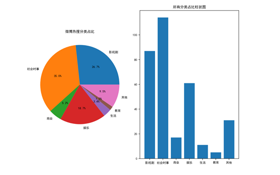
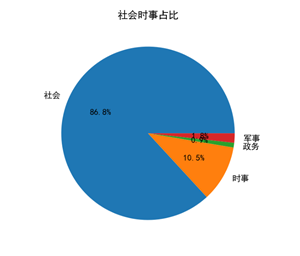
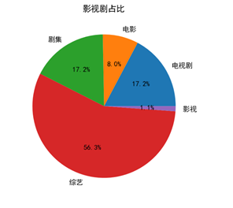
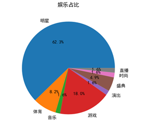
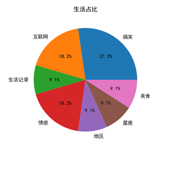
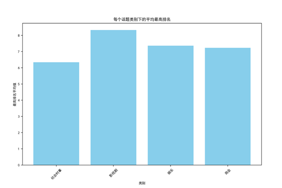
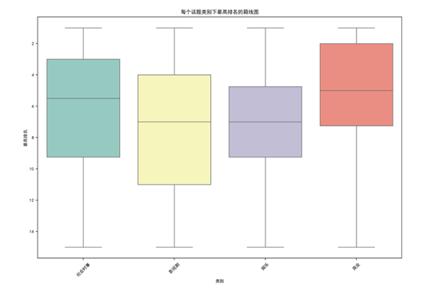
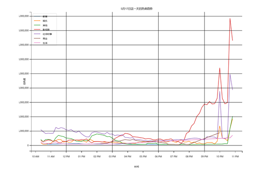

互联网发展后，人们观察世界、获取信息的方式变成了线上获取，在一个趋向娱乐化的时代，我很好奇人们在微博上都在关注什么，是不是真的全部都是明星、娱乐、八卦呢，微博上的严肃信息还有多少呢？ 

# 微博热搜的分类占比  

首先，我想观察不同热搜的类型占比究竟有多大。  我把微博上可见的不同类别总共归为社会时事、影视剧、娱乐、商业、生活、教育这6种

在streamlit中显示饼状图和柱状图，来统计类别占比，结果如下：

  

我们可以看到，社会时事占比最多为35%，但是娱乐、影视剧等非严肃内容高达45%，可以说人们在微博上对社会时事的内容有一定关注，但不多。  

下面的几个饼状图是不同类别下的细分类别占比。  

  

影视剧中占比最多的是综艺，有56%。综艺相对于电视剧和电影来讲，娱乐程度更高，严肃内容较少。 

  

在娱乐中明星的占比最高，有62%。可以分析出微博中最多的娱乐内容与娱乐圈有关。  

  

生活下不同类型的记录分布比较平均。

# 不同话题类别的热搜排名分布

画出柱状图如下

  

微博热搜排名是数字越小越好，可以看出来社会时事的排名相对更靠前，影视剧比较落后

接下来画出排名的箱线图，箱线图可以更好表达排名数据的分布特点，结果如下

  

结合饼状图、柱状图、箱线图来开，虽然严肃内容不如娱乐内容的数量多，但是严肃内容的话题排名更靠前，受到的全民关注多，而娱乐内容排名较后

# 分析不同话题在一天中的时间趋势

我选取5.17这一天的数据，因为这一天全天都在爬虫，数据保留得最完整。    

绘制折线图结果如下：  

  

观察折线图发现，在下午3点前社会时事的热度最高，可见人们在白天挺关注社会新闻的。下午三点之后，影视剧的内容最高，但几种类别热度相差不大，白天下午是工作比较疲惫的实际段，人们翻看热搜的兴趣不大。下午7点之后，影视剧内容急速攀升，结合那一天的事情来看，电视剧《庆余年》第二部7点播出，所以人们对于影视剧的讨论非常热情。而大概在晚上10点左右，基本上所有的话题热度都有所增高，可见人们刷微博的时间集中在晚上。     

# 开发工具

python
streamlit
matplotlib